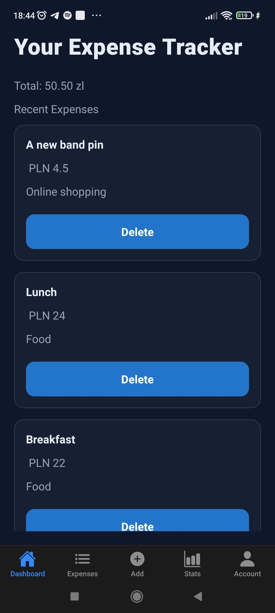
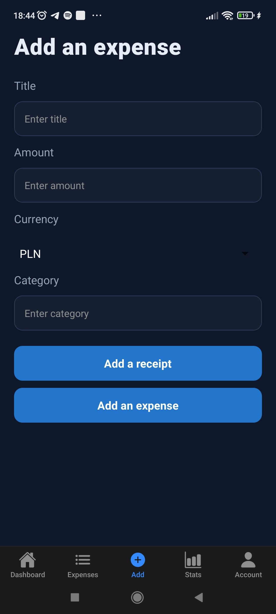
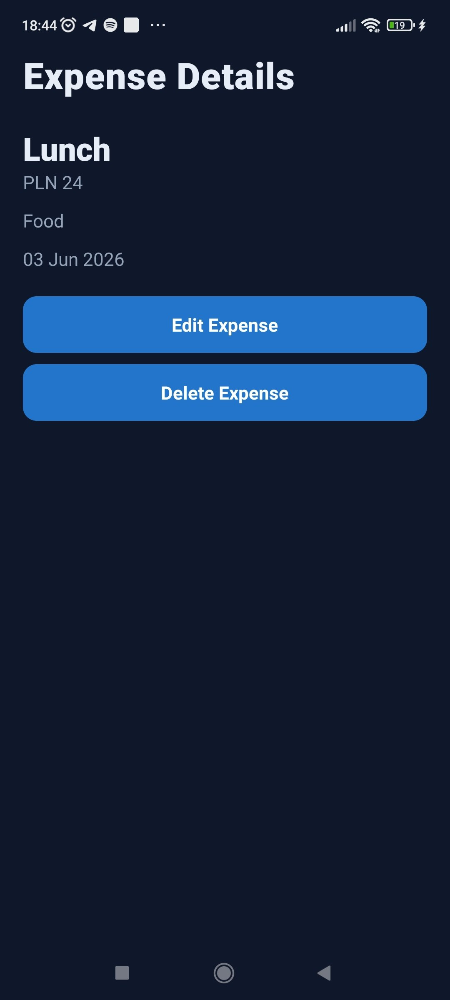
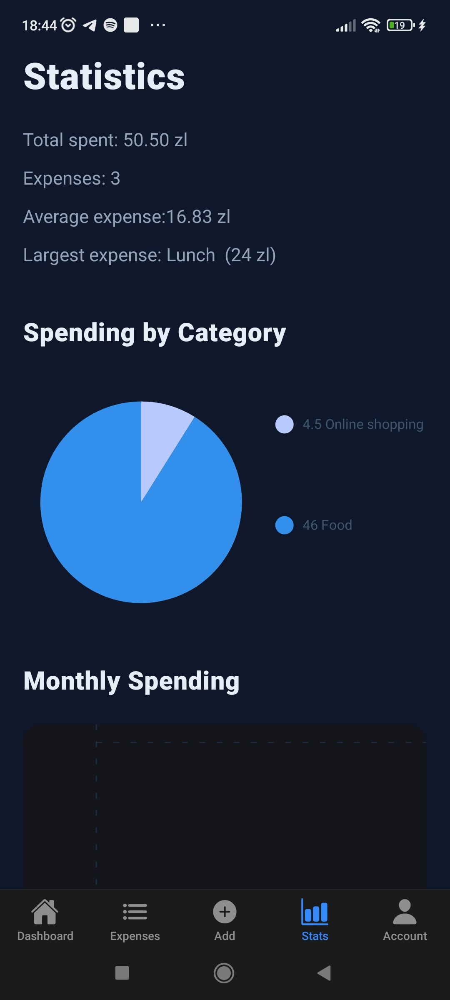
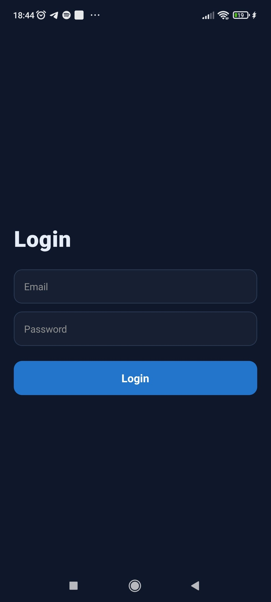
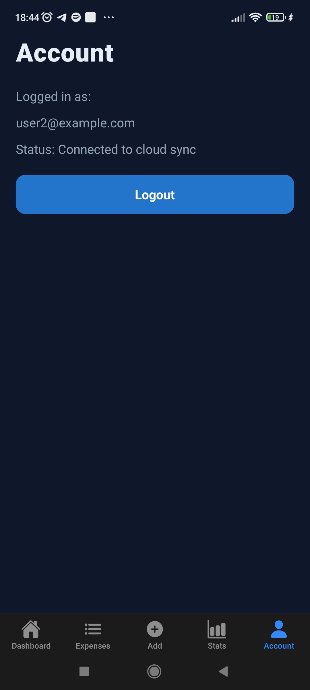

# Expense Tracker

Aplikacja mobilna do zarządzania osobistymi wydatkami stworzona w React Native.

Celem aplikacji jest ułatwienie użytkownikowi zapisywania, organizowania i analizowania swoich wydatków. 
Użytkownik może dodawać wydatki, przypisywać im kategorie, wybierać walutę, dodawać zdjęcia paragonów oraz przeglądać statystyki swoich wydatków.

Aplikacja obsługuje zarówno tryb gościa z lokalnym zapisem danych, jak i konta użytkowników z synchronizacją danych w chmurze.

---

## Główne funkcjonalności

- Dodawanie nowych wydatków
- Edycja istniejących wydatków
- Usuwanie wydatków z potwierdzeniem
- Kategorie wydatków
- Wybór waluty
- Dodawanie zdjęć paragonów
- Robienie zdjęć przy użyciu aparatu
- Podgląd szczegółów wydatku
- Statystyki wydatków
- Logowanie użytkownika
- Synchronizacja danych z chmurą
- Obsługa trybu offline dla wydatków gościa

---

## Ekrany aplikacji

### Dashboard
- Podsumowanie wydatków
- Całkowita kwota wydatków
- Lista ostatnich wydatków
- Przejście do szczegółów wydatku


### Dodawanie wydatku
- Wprowadzanie tytułu
- Wprowadzanie kwoty
- Wybór kategorii
- Wybór waluty
- Dodanie zdjęcia paragonu


### Szczegóły wydatku
- Informacje o wydatku
- Data oraz kategoria
- Podgląd zdjęcia paragonu
- Edycja wydatku
- Usunięcie wydatku


### Statystyki
- Analiza wydatków
- Podsumowanie wydatków użytkownika


### Konto
- Logowanie
- Zarządzanie kontem użytkownika




---

## Technologie

Projekt został wykonany przy użyciu:

- React Native
- Expo
- TypeScript
- Expo Router
- Redux Toolkit
- Supabase
- AsyncStorage

---

# Uruchomienie projektu

## 1. Pobranie projektu

1) Sklonuj repozytorium:

```bash
   git clone <repository-url>
```

2) Przejdź do folderu projektu i instaluj zależności

```bash
   cd react_native_project
   npm install
```

3) Konfiguruj zmiennych środowiskowych

W głównym folderze projektu utwórz plik:

.env

Następnie dodaj konfigurację Supabase:

EXPO_PUBLIC_SUPABASE_URL=twoj_supabase_url

EXPO_PUBLIC_SUPABASE_ANON_KEY=twoj_supabase_anon_key

4) Uruchom serwer Expo:

```bash
   npx expo start
```

Android: 
Aby uruchomić aplikację na Androidzie:

```bash
   npm run android
```

iOS: 
Aby uruchomić aplikację na iOS:

```bash
   npm run ios
```

Testy:
Aby uruchomić testy:

```bash
   npm test
```
Budowanie aplikacji:
Do stworzenia wersji Android można użyć:

```bash
   eas build --platform android --profile preview
```


the link for the eas build: 
https://expo.dev/accounts/alesia.sichova/projects/react_native_project/builds/7d72485d-d93e-4686-b7df-507ad5f43584
